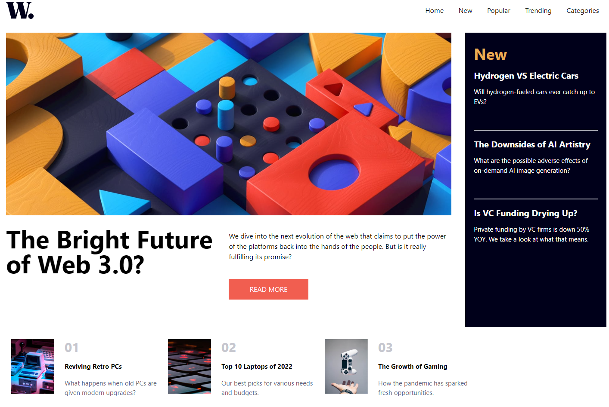

# Frontend Mentor - News homepage

Los desafíos te ayudan a mejorar tus habilidades de codificación mediante la creación de proyectos realistas.

esta es mi solución a [News homepage challenge on Frontend Mentor](https://news-homepage-neon.vercel.app/). 

## Tabla de Contenido

- Descripción General

En esta oportunidad voy a realizar este proyecto con JavaScript, React Vite y Tailwind CSS, mi propósito es aprender Tailwind y ganar experiencia creando una página responsiva, para un Desarrollador Web Junior cada proyecto cuenta.

- El Reto

Implementar la correcta utilización de los puntos de quiebre para hacer la Home-Page responsiva.

### Screenshot
- 

- [Links](https://news-homepage-neon.vercel.app/)

- Mi proceso

En mi etapa de formación, FrontEndMentor ha jugado un papel importante, ya que me ha dado la oportunidad de ganar experiencia y aprender nuevas tecnologías, como ejemplo de ello, en este proyecto aprender Tailwind fue el premio, se que he ganado la suficiente experiencia hasta ahora para afrontar mi primera experiencia laboral como desarrollador front-end.

## Author

Rodolfo Antonio Rodríguez Quintero 

- GitHub - [Rodolfo Rodriguez](https://github.com/rodjoker/News-homepage)
- Frontend Mentor - [@rodjoher](https://www.frontendmentor.io/profile/rodjoker)

